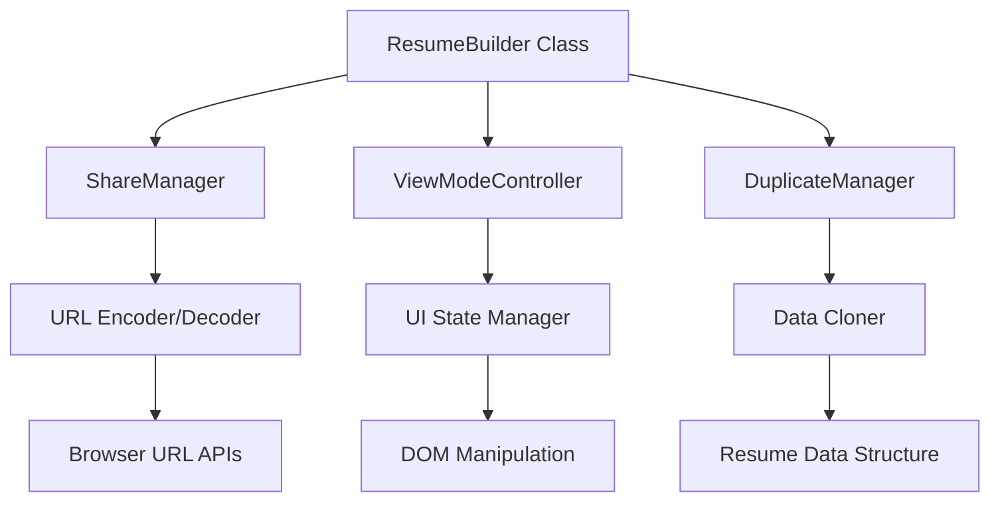

# Design Document: Resume Share & Duplicate

## Overview

This design extends the existing Resume Builder application to support public resume sharing via URLs and duplication functionality. The enhancement builds upon the current class-based architecture while adding new components for URL-based sharing, view-only mode, and resume duplication.

The design maintains backward compatibility with existing functionality while introducing a clean separation between view and edit modes. The solution uses client-side URL encoding to avoid requiring backend infrastructure.

## Architecture

### Current Architecture Analysis

The existing Resume Builder follows a single-page application pattern with:
- **ResumeBuilder Class**: Main controller managing resume data and UI interactions
- **Data Model**: Nested JavaScript object structure (`resumeData`) containing all resume information
- **Template System**: Multiple resume templates (minimal, creative, corporate) with dynamic rendering
- **Theme System**: Dark/light themes with CSS custom properties
- **File-based Sharing**: JSON file download and WhatsApp text sharing

### Enhanced Architecture

The enhanced system adds three new architectural components:



**New Components:**
1. **ShareManager**: Handles URL generation and encoding/decoding of resume data
2. **ViewModeController**: Manages the view-only interface state and transitions
3. **DuplicateManager**: Creates independent copies of shared resumes

## Components and Interfaces

### ShareManager Component

**Purpose**: Manages the creation and parsing of shareable URLs containing encoded resume data.

**Key Methods**:
```javascript
class ShareManager {
    generateShareURL(resumeData, settings)     // Creates encoded URL
    parseShareURL(url)                         // Extracts resume data from URL
    validateResumeData(data)                   // Validates decoded data structure
    handleURLLimitations(data)                 // Manages large data sets
}
```

**Integration**: Extends the existing share modal functionality by adding a new "Generate Public Link" option alongside current file and WhatsApp sharing.

### ViewModeController Component

**Purpose**: Manages the interface state when displaying shared resumes in view-only mode.

**Key Methods**:
```javascript
class ViewModeController {
    enterViewMode(resumeData)                  // Switches to view-only interface
    exitViewMode()                             // Returns to edit mode
    hideEditingControls()                      // Hides form sections and buttons
    showDuplicateButton()                      // Displays "Use This Resume" button
    adjustLayoutForViewing()                   // Expands preview to full width
}
```

**UI Changes**:
- Hide left form panel entirely
- Expand resume preview to full width
- Replace header buttons with "Use This Resume" action
- Add minimal header with app branding

### DuplicateManager Component

**Purpose**: Creates independent copies of shared resumes for editing.

**Key Methods**:
```javascript
class DuplicateManager {
    createResumeCopy(originalData)             // Deep clones resume data
    initializeEditMode(copiedData)             // Sets up editing interface
    clearOriginalReference()                   // Ensures independence from source
    validateCopyIntegrity(data)                // Verifies successful duplication
}
```

**Data Independence**: Uses deep cloning to ensure modifications to the copy don't affect the original shared resume.

## Data Models

### Enhanced Resume Data Structure

The existing `resumeData` structure remains unchanged, but the sharing system adds metadata:

```javascript
const shareableResumeData = {
    // Existing resume data structure
    personal: { /* existing fields */ },
    summary: "...",
    experience: [...],
    education: [...],
    skills: [...],
    projects: [...],
    social: { /* existing fields */ },
    certifications: [...],
    languages: [...],
    hobbies: [...],
    
    // Enhanced with settings for complete sharing
    settings: {
        template: "minimal|creative|corporate",
        primaryColor: "#2563eb",
        fontFamily: "Inter",
        isDarkTheme: false,
        shareMetadata: {
            createdAt: "2024-01-01T00:00:00Z",
            version: "1.0"
        }
    }
}
```

### URL Structure

Shareable URLs follow this pattern:
```
https://domain.com/resume-builder?data=<base64-encoded-resume-data>
```

**Encoding Process**:
1. Serialize complete resume data and settings to JSON
2. Encode JSON string using Base64 (btoa)
3. Append as URL parameter
4. Handle URL length limitations for large datasets

## Correctness Properties

*A property is a characteristic or behavior that should hold true across all valid executions of a system—essentially, a formal statement about what the system should do. Properties serve as the bridge between human-readable specifications and machine-verifiable correctness guarantees.*

### Property 1: Share URL Generation and Structure
*For any* resume data and settings, when generating a share URL, the system should produce a valid URL containing Base64-encoded data as a parameter
**Validates: Requirements 1.1, 5.1, 5.2**

### Property 2: Resume Data Round-Trip Integrity  
*For any* complete resume data (including all sections and visual settings), encoding into a share URL then decoding should produce equivalent data
**Validates: Requirements 1.2, 1.4, 1.5**

### Property 3: View Mode Activation
*For any* valid share URL with resume data, accessing the URL should trigger view mode display
**Validates: Requirements 1.3, 2.1**

### Property 4: View Mode UI State
*For any* system in view mode, all editing controls should be hidden and only the resume preview should be displayed with a "Use This Resume" button
**Validates: Requirements 2.2, 2.3, 2.5, 7.1, 7.2, 7.3**

### Property 5: Visual Settings Preservation
*For any* resume with specific template, colors, fonts, and theme settings, these settings should be preserved and applied correctly in view mode and after duplication
**Validates: Requirements 2.4, 3.4, 8.3**

### Property 6: Resume Duplication Integrity
*For any* resume in view mode, clicking "Use This Resume" should create an identical copy with all data preserved and switch to edit mode
**Validates: Requirements 3.1, 3.2, 3.3**

### Property 7: Copy Independence
*For any* duplicated resume, modifications to the copy should not affect the original share URL content, ensuring complete data independence
**Validates: Requirements 3.5, 4.1, 4.2, 4.5**

### Property 8: Copy Functionality Equivalence
*For any* duplicated resume, all standard resume operations (save, share, edit) should work identically to original resumes
**Validates: Requirements 4.3, 4.4**

### Property 9: Data Validation and Error Handling
*For any* invalid or corrupted share URL data, the system should validate the JSON structure and display appropriate error messages while loading a default empty resume
**Validates: Requirements 5.3, 5.4, 8.1, 8.4**

### Property 10: Comprehensive Data Loading
*For any* valid share URL, the system should load all resume sections (personal, experience, education, skills, projects, certifications, languages, hobbies) and clear any existing data first
**Validates: Requirements 8.2, 8.5**

### Property 11: Share Modal Enhancement
*For any* share modal interaction, the existing options should remain available and a new "Generate Public Link" option should be present and functional
**Validates: Requirements 6.1, 6.2, 6.3**

### Property 12: Browser Compatibility
*For any* modern browser environment, the system should use standard Base64 APIs and validate browser support before enabling sharing features
**Validates: Requirements 9.1, 9.4, 9.5**

### Property 13: Large Data Handling
*For any* resume with large datasets, the system should handle URL length limitations gracefully without data loss
**Validates: Requirements 5.5**

<function_calls>
<invoke name="prework">
<parameter name="featureName">resume-share-duplicate

## Error Handling

### URL Parsing Errors
- **Invalid Base64 Data**: Display user-friendly error message and load empty resume
- **Malformed JSON**: Validate JSON structure before parsing and provide fallback
- **Missing Required Fields**: Check for essential resume data fields and handle gracefully
- **URL Length Limitations**: Detect browser URL limits and provide alternative sharing methods

### Browser Compatibility Issues
- **Feature Detection**: Check for btoa/atob support before enabling URL sharing
- **Clipboard API**: Graceful degradation for browsers without clipboard access
- **URL Parameter Limits**: Handle different browser URL length restrictions

### Data Integrity Errors
- **Encoding Failures**: Catch and handle Base64 encoding errors
- **Large Dataset Handling**: Implement compression or chunking for oversized resumes
- **Character Encoding**: Handle special characters and Unicode in resume data

### User Experience Errors
- **Network Issues**: Handle offline scenarios gracefully
- **Loading States**: Provide feedback during URL processing and data loading
- **Validation Feedback**: Clear error messages for invalid share URLs

## Testing Strategy

### Dual Testing Approach

The testing strategy employs both unit tests and property-based tests to ensure comprehensive coverage:

**Unit Tests** focus on:
- Specific examples of URL generation and parsing
- Edge cases like empty resume data or missing fields
- Error conditions and browser compatibility scenarios
- Integration points between existing and new components

**Property-Based Tests** focus on:
- Universal properties that hold for all resume data combinations
- Round-trip integrity across different data sizes and structures
- UI state consistency across all view mode transitions
- Data independence between original and copied resumes

### Property-Based Testing Configuration

- **Testing Library**: Use fast-check for JavaScript property-based testing
- **Test Iterations**: Minimum 100 iterations per property test
- **Data Generators**: Custom generators for resume data, visual settings, and URL structures
- **Test Tags**: Each property test references its design document property

**Example Property Test Structure**:
```javascript
// Feature: resume-share-duplicate, Property 2: Resume Data Round-Trip Integrity
fc.assert(fc.property(
    resumeDataGenerator(),
    visualSettingsGenerator(),
    (resumeData, settings) => {
        const shareUrl = shareManager.generateShareURL(resumeData, settings);
        const decoded = shareManager.parseShareURL(shareUrl);
        return deepEqual(decoded.resumeData, resumeData) && 
               deepEqual(decoded.settings, settings);
    }
), { numRuns: 100 });
```

### Integration Testing

- **Cross-Component Testing**: Verify seamless integration between ShareManager, ViewModeController, and DuplicateManager
- **Existing Feature Compatibility**: Ensure new functionality doesn't break current save/load/share features
- **Browser Testing**: Test across Chrome, Firefox, Safari, and Edge for compatibility
- **URL Length Testing**: Test with various resume sizes to validate URL handling

### User Acceptance Testing

- **Sharing Workflow**: End-to-end testing of share URL generation and access
- **Duplication Workflow**: Complete testing of view mode to edit mode transition
- **Data Persistence**: Verify independence between original and copied resumes
- **Error Scenarios**: Test user experience with invalid URLs and error conditions